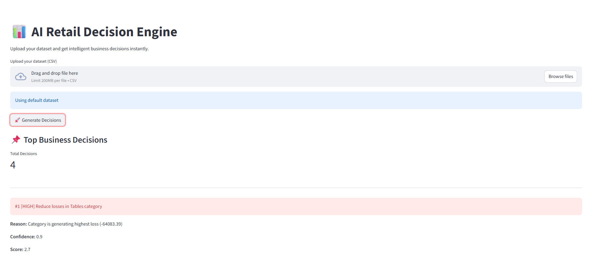
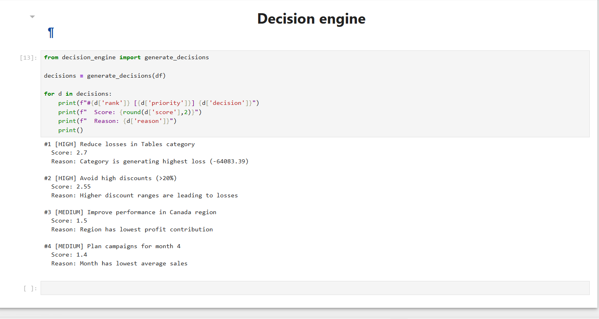

# 📊 AI-Powered Retail Decision Engine

An end-to-end AI-driven system that analyzes retail sales data and generates actionable business decisions with priority ranking and confidence scoring.

---

## 🎯 Overview

This project transforms raw retail data into intelligent business decisions.

Instead of just analyzing data, it focuses on answering:

👉 “What should the business do next?”

The system performs:
- Data analysis
- Insight generation
- Decision-making
- Decision ranking

---

## 🚀 Features

- 📊 Data Analysis (Sales, Profit, Discounts)
- 🧠 Insight Generation (loss categories, trends, regions)
- ⚙️ Rule-Based Decision Engine
- 📌 Decision Prioritization & Ranking
- 🎯 Confidence Scoring
- 📈 Sales Forecasting
- 🌐 Interactive Streamlit Dashboard

---

## 🧠 How It Works

Data → Analysis → Insights → Decision Engine → Scoring → Ranking → Output

---

## 📊 Example Output
#1 [HIGH] Reduce losses in Tables category
Reason: Category generating highest loss
Confidence: 0.9
Score: 2.7

#2 [HIGH] Avoid high discounts (>20%)
Reason: Discounts causing losses
Confidence: 0.85
Score: 2.55


---

## 🖥️ Demo

### 🔹 Streamlit App


### 🔹 Notebook Analysis


---

## ⚙️ Installation & Setup

```bash
git clone https://github.com/your-username/ai-decision-engine.git
cd ai-decision-engine

python -m venv venv
venv\Scripts\activate   # Windows

pip install -r requirements.txt